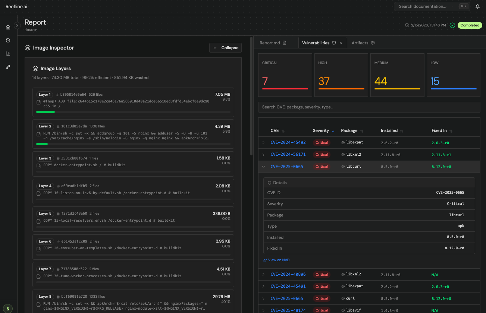
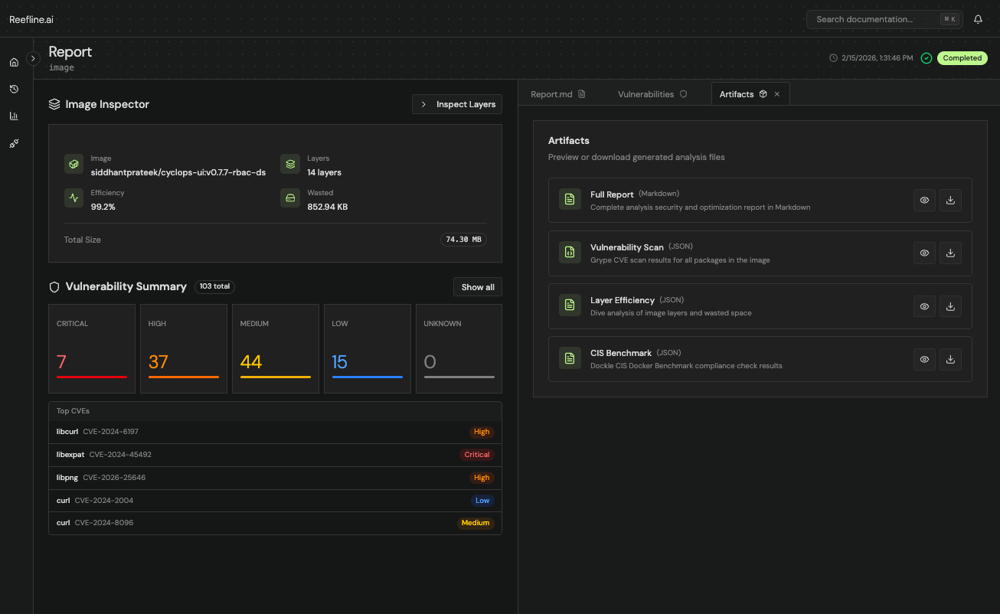

# Hackathon Submission - Reefline

> Container image hygiene and runtime security for modern Kubernetes infrastructure.


## Demo

> Watch the full demo on [YouTube](https://www.youtube.com/watch?v=rQRcPPCOZ_w).

## Tools & Technologies Used

### Frontend Development
- **Vite** - Lightning-fast frontend build tool
- **TypeScript** - Type-safe JavaScript development
- **shadcn/ui** - Beautifully designed UI components
- **Tailwind CSS** - Utility-first CSS framework

### Design Inspiration & Resources
- **[navbar.gallery](https://www.navbar.gallery)** - Navigation component inspiration
- **[IndieHub](https://indiehub.best/tool?category=ui-component)** - UI component discovery and inspiration

### AI Development Tools
- **Google's Antigravity** - AI-powered development assistance
- **Claude Code** - Anthropic's CLI tool for AI-assisted coding

### Development Workflow
- **Git** - Version control
- **Bun** - Fast JavaScript runtime and package manager
- **Node.js** - JavaScript runtime environment

## Third Party Stack

- [Archestra AI](https://archestra.ai) — LLM Proxy, MCP Registry, and Tool Policies used to keep agent access locked down and observable.
- [Grype](https://github.com/anchore/grype) — Vulnerability scanner
- [Dockle](https://github.com/goodwithtech/dockle) — CIS Docker Benchmark
- [Dive](https://github.com/wagoodman/dive) — Image layer analyzer
- [Fiber](https://github.com/gofiber/fiber) — Go HTTP framework

## Architecture

Reefline uses a **server-worker separation** pattern across five core components:


### Components

#### 1. UI (Dashboard)
The dashboard is where users manage container images and registries, trigger analysis jobs, view generated security reports, and escalate findings to their team. It provides real-time job progress via SSE, deep layer inspection, vulnerability browsing, and artifact downloads.

#### 2. API Server
The HTTP API server (Fiber/Go) handles all client requests — job submission, status queries, integrations, and artifact retrieval. It enqueues scan jobs to Redis (Asynq) and returns immediately, keeping the API responsive regardless of scan duration.

**Why PostgreSQL?**
Scan jobs and their results are structured, relational data with predictable access patterns — PostgreSQL's ACID guarantees and rich query support are a natural fit. Since analysis data doesn't require horizontal database scaling, a single reliable Postgres instance is simpler and more operationally sound than a distributed store.

#### 3. Worker
Pulling an image, generating an SBOM, running vulnerability scans, and inspecting every layer is a time-intensive process — asynchronous job processing is the right approach. Three options were considered:

- **In-process** — blocks the API server, poor isolation
- **Separate worker process** — independent scaling, clean separation (current approach)
- **Fully containerized/isolated environment** — each job runs in its own container for maximum isolation

The worker process was chosen as the pragmatic starting point. As the infrastructure grows, the natural evolution is full container-level isolation per job — giving complete resource boundaries and eliminating any cross-job interference.

#### 4. Flow (AI Report Generation)
Flow is a Python service responsible for AI-powered report generation. Once the worker has collected all scan evidence (Grype, Dockle, Dive outputs), it calls Flow to synthesize a final security report using a Supervisor + Critique agent pattern.

Python was chosen here due to a real constraint: Go's LLM framework ecosystem is immature. An attempt was made to use [cloudwego/eino](https://github.com/cloudwego/eino), but LLMs consistently struggled to implement the agent flow correctly from its examples — the generated code was technically functional in isolation but became unmaintainable quickly. Since most AI frameworks (LangChain, LangGraph, etc.) are Python-first with mature tooling and documentation, switching to Python for this component was the practical call. It would have been one fewer architectural component, but reliability mattered more.

**Archestra AI Integration**

Flow proxies all LLM calls through Archestra, which acts as the LLM Proxy, MCP Registry, and Tool Policy layer:

```python
PROVIDER_BASE_URLS: dict[str, str] = {
    "openai":     "http://localhost:9004/v1/openai/84ea7ec8-1640-44c7-95b3-83aa331104dd",
    "anthropic":  "https://api.anthropic.com/v1",
    "google":     "https://generativelanguage.googleapis.com/v1beta/openai",
    "openrouter": "https://openrouter.ai/api/v1",
}
```

Setting the `openai` base URL to the Archestra proxy endpoint routes all LLM traffic through Archestra, where Tool Policies, access control, logs/traces, and cost monitoring are centrally managed.

Supported LLM providers: **OpenAI**, **Anthropic**, **Google Gemini**, **OpenRouter**

#### 5. Reefline MCP Server
Reefline exposes an MCP server that runs in both `stdio` and HTTP modes. This allows AI applications — Claude Code, Cursor, Archestra Chat UI — to interact directly with Reefline: create scan jobs, query results, analyze reports, and more, all through natural language.

**Supported integrations:**
- Container Registries: Kubernetes (in-cluster), Docker, Harbor, GHCR
- LLM Providers: OpenAI, Anthropic, OpenRouter, Google Gemini

#### MinIO Object Storage
All scan artifacts are stored in MinIO (S3-compatible). Each job gets its own prefix:

```
{bucket}/{job_id}/
├── grype.json      ← Vulnerability scan results
├── dockle.json     ← CIS benchmark results
├── dive.json       ← Layer efficiency analysis
├── report.md       ← Final AI-generated report
└── draft.md        ← Supervisor agent first-pass draft
```

### Scanning Pipeline

| Stage | Tool | Progress |
|-------|------|----------|
| Image inspection | Skopeo (containers/image) | 0–10% |
| Vulnerability scan | Grype | 10–35% |
| CIS benchmark | Dockle | 35–65% |
| Layer analysis | Dive | 65–95% |
| AI report generation | Flow (Supervisor + Critique agents) | 95–100% |

### MinIO Artifact Structure

```
{bucket}/{job_id}/
├── grype.json      ← Vulnerability scan results
├── dockle.json     ← CIS benchmark results
├── dive.json       ← Layer efficiency analysis
├── report.md       ← Final AI-generated report
└── draft.md        ← Supervisor agent first-pass draft
```


## Tech Stack

### Backend (Go)
| Component | Technology |
|-----------|-----------|
| HTTP Framework | [Fiber v2](https://github.com/gofiber/fiber) |
| Database | PostgreSQL + [GORM](https://gorm.io) |
| Object Storage | [MinIO](https://github.com/minio/minio-go) |
| Job Queue | [Redis + Asynq](https://github.com/hibiken/asynq) (in-memory fallback) |
| Vulnerability Scanner | [Grype](https://github.com/anchore/grype) |
| CIS Benchmark | [Dockle](https://github.com/goodwithtech/dockle) |
| Layer Analyzer | [Dive](https://github.com/wagoodman/dive) |
| Image Inspector | [containers/image](https://github.com/containers/image) |
| Telemetry | [OpenTelemetry](https://opentelemetry.io) |
| Encryption | AES-256-GCM |
| Kubernetes Client | [client-go](https://github.com/kubernetes/client-go) |

### Frontend
| App | Stack |
|-----|-------|
| `frontend/dashboard/` | React + TypeScript + Vite + shadcn/ui + Tailwind |
| `frontend/web/` | Next.js + TypeScript + shadcn/ui + Tailwind |

### Infrastructure
- PostgreSQL 16
- MinIO (S3-compatible object storage)
- Redis 7
- Docker Compose (local dev)


### Metrics
```
GET /metrics/queue    → Queue stats (active, pending, throughput)
GET /metrics/jobs     → Job trends (time_range=24h|7d|30d)
GET /metrics/tools    → Per-tool performance (avg duration, success rate)
```

## Environment Variables


### Security Tools (worker only)
| Variable | Default | Description |
|----------|---------|-------------|
| `VULNERABILITY_SCANNER_ENABLED` | `true` | Enable Grype |
| `DOCKLE_SCANNER_ENABLED` | `true` | Enable Dockle |
| `DIVE_ANALYZER_ENABLED` | `true` | Enable Dive |
| `IMAGE_INSPECTOR_ENABLED` | `true` | Enable image metadata inspection |

### AI / Flow Service
| Variable | Description |
|----------|-------------|
| `FLOW_SERVICE_URL` | URL of the Python flow service (AI report generation) |
| `FLOW_PROVIDER` | `openai`, `anthropic`, `google`, or `openrouter` |

### Encryption
| Variable | Description |
|----------|-------------|
| `ENCRYPTION_KEY` | Base64-encoded 32-byte key. Generate: `openssl rand -base64 32` |

### Telemetry
| Variable | Default |
|----------|---------|
| `OTEL_ENABLED` | `true` |
| `OTEL_SERVICE_NAME` | `reefline-server` |
| `OTEL_SERVICE_VERSION` | `1.0.0` |

## Archestra AI Integration

Reefline uses [Archestra AI](https://archestra.ai) as its LLM Proxy, MCP Registry, and Tool Policy layer — keeping agent access locked down and observable.

### Setting Up the MCP Server

**1. Start the MCP server in HTTP mode:**

```bash
bun run start:http
```

**2. Expose it publicly with ngrok:**

```bash
ngrok http 4000
```

Copy the ngrok URL (e.g. `https://abc123.ngrok.io`).

---

### Registering with Archestra MCP Registry

1. Open the [Archestra dashboard](https://archestra.ai) and navigate to **MCP Registry**.
2. Click **"Add MCP Server"**.
3. Fill in:
   - **Name:** `reefline`
   - **Server URL:** your ngrok URL (e.g. `https://abc123.ngrok.io`)
   - **Auth:** None
4. Save the server. Archestra will discover all tools exposed by Reefline's MCP server.

---

### Tool Policies

Once the server is registered, you must explicitly grant tool access — the LLM cannot use any tool until it's allowed in Tool Policies.

Navigate to **Tool Policies** in the Archestra dashboard and allow the tools you want the agent to access:


Key tools to enable:
- `transfer_to_supervisoragent`
- `transfer_to_critiqueagent`
- `agent__supervisor`
- `write_file`
- `read_file`

---

### Archestra Chat Demo

Once registered and policies are configured, you can interact with Reefline via the Archestra Chat Interface — querying scan jobs, pulling reports, and getting security insights conversationally.


---

## User Journey

A user submits an image from the Reefline dashboard. Within 2–3 minutes, Reefline has:

1. Pulled and inspected the image metadata (Skopeo/containers-image)
2. Run a full vulnerability scan (Grype) — surfacing CVEs with severity, package, and fix version
3. Checked CIS Docker Benchmark compliance (Dockle)
4. Analyzed every layer for efficiency and wasted space (Dive)
5. Generated an AI-authored security report with Dockerfile optimization suggestions (Flow)

The report surfaces:
- Vulnerability counts by severity (Critical / High / Medium / Low) with top CVEs
- Layer-by-layer breakdown — which commands created each layer, file counts, and sizes
- Risk assessments and actionable remediation steps



Users can drill into individual layers to understand exactly what's in each one — command, size, file count — making it easy to identify bloated or unnecessary layers.

Under the **Artifacts** tab, users can preview or download all raw evidence collected during the scan:



- **Full Report** (Markdown) — complete AI-generated security and optimization report
- **Vulnerability Scan** (JSON) — raw Grype CVE results
- **Layer Efficiency** (JSON) — Dive layer analysis
- **CIS Benchmark** (JSON) — Dockle compliance results


## Challenges

**Go LLM ecosystem maturity**
The biggest blocker was implementing the agent flow in Go. [cloudwego/eino](https://github.com/cloudwego/eino) was attempted as the framework, but LLMs could not reliably implement even straightforward examples from its documentation. The generated code would work in isolation but quickly became unrecognizable as more pieces were added — violating basic software engineering principles around maintainability. The decision was made to drop the Go framework entirely and rewrite the AI component in Python, where LangGraph/LangChain have mature, battle-tested patterns. This added a component to the architecture but was the right trade-off for reliability.

**Asynchronous scan pipeline**
Coordinating progress reporting across four independent tools (Skopeo → Grype → Dockle → Dive → Flow) with meaningful percentage updates required careful orchestration. Each tool runs sequentially, with progress events streamed to the frontend via SSE so users get live feedback rather than a blank wait screen.

**Encrypted credential storage**
Integration credentials (GitHub tokens, Docker Hub passwords, Harbor tokens) needed to be stored securely. AES-256-GCM encryption was implemented in `pkg/crypto` so credentials are never stored in plaintext in PostgreSQL.

**Worker isolation trade-offs**
Separating the worker from the server was straightforward, but full per-job container isolation (the ideal end state) was descoped in favor of shipping a working product. The current worker process model works well at small scale; container isolation is the clear next step as the platform grows.


## Development Approach

This project leverages modern development tools and AI assistance to accelerate the development process while maintaining code quality and security standards.

The use of AI coding tools like Google's Antigravity and Claude Code to maintain consistency and best practices throughout the codebase while speeding up implementation.
