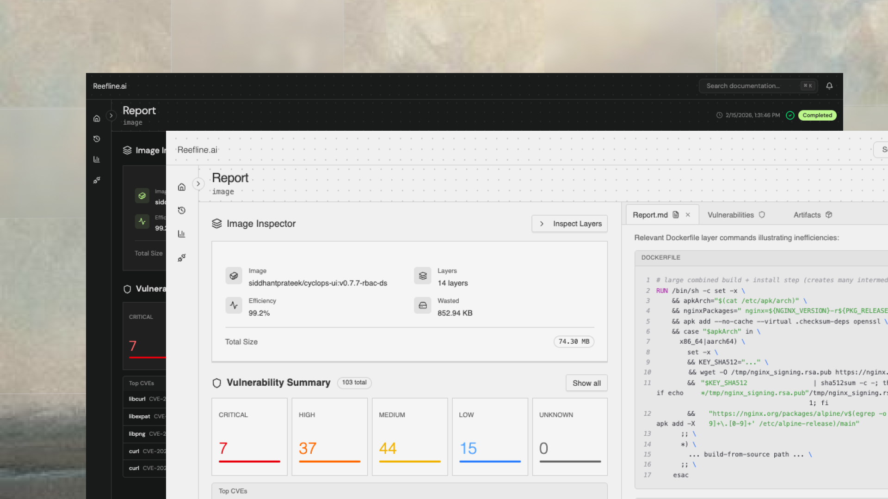
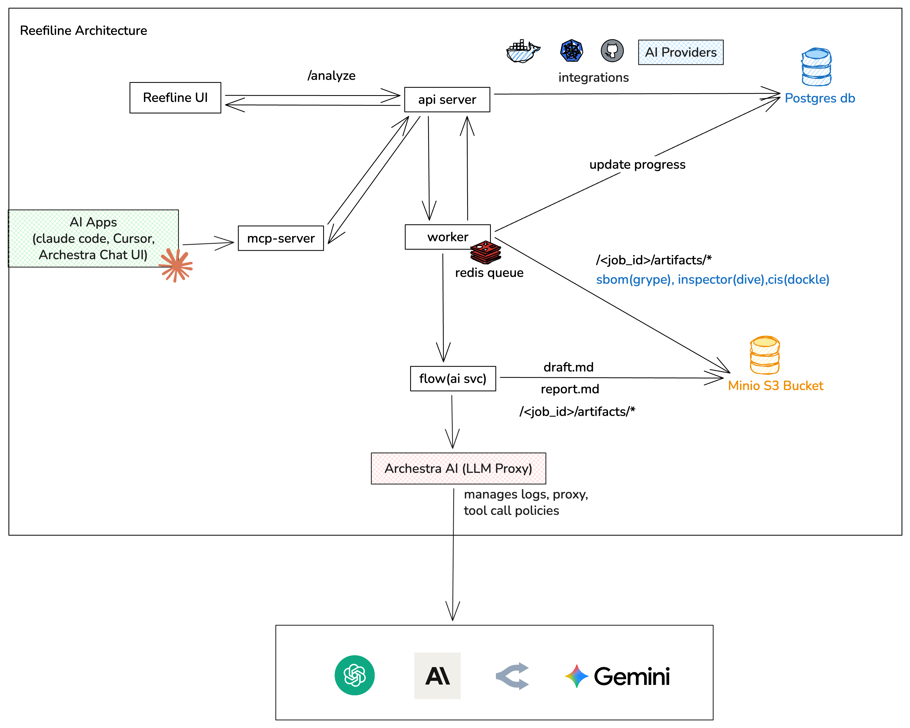
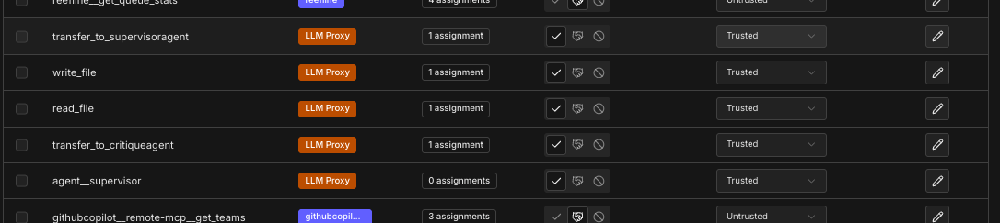
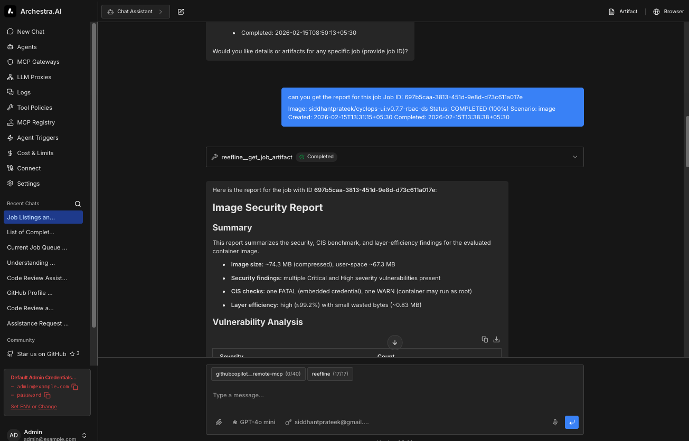

# Hackathon Submission - Reefline

> Container image hygiene and runtime security for modern Kubernetes infrastructure.



## Tools & Technologies Used

### Frontend Development
- **Vite** - Lightning-fast frontend build tool
- **TypeScript** - Type-safe JavaScript development
- **shadcn/ui** - Beautifully designed UI components
- **Tailwind CSS** - Utility-first CSS framework

### Design Inspiration & Resources
- **[navbar.gallery](https://www.navbar.gallery)** - Navigation component inspiration
- **[IndieHub](https://indiehub.best/tool?category=ui-component)** - UI component discovery and inspiration

### AI Development Tools
- **Google's Antigravity** - AI-powered development assistance
- **Claude Code** - Anthropic's CLI tool for AI-assisted coding

### Development Workflow
- **Git** - Version control
- **Bun** - Fast JavaScript runtime and package manager
- **Node.js** - JavaScript runtime environment

## Third Party Stack

- [Archestra AI](https://archestra.ai) — LLM Proxy, MCP Registry, and Tool Policies used to keep agent access locked down and observable.
- [Grype](https://github.com/anchore/grype) — Vulnerability scanner
- [Dockle](https://github.com/goodwithtech/dockle) — CIS Docker Benchmark
- [Dive](https://github.com/wagoodman/dive) — Image layer analyzer
- [Fiber](https://github.com/gofiber/fiber) — Go HTTP framework

## Architecture

Reefline uses a **server-worker separation** pattern:

```
Client → HTTP Server (Fiber) → Redis Queue (Asynq)
                                      ↓
                               Worker Process
                          ┌────────────────────┐
                          │  Grype (CVE scan)  │
                          │  Dockle (CIS bench)│
                          │  Dive (layers)     │
                          │  Flow (AI report)  │
                          └────────────────────┘
                                      ↓
                              MinIO (artifacts)
                              PostgreSQL (state)
```

The server handles HTTP requests and enqueues jobs. The worker runs CPU/memory-intensive security scans independently — both can be scaled horizontally.

### Scanning Pipeline

| Stage | Tool | Progress |
|-------|------|----------|
| Image inspection | Skopeo (containers/image) | 0–10% |
| Vulnerability scan | Grype | 10–35% |
| CIS benchmark | Dockle | 35–65% |
| Layer analysis | Dive | 65–95% |
| AI report generation | Flow (Supervisor + Critique agents) | 95–100% |

### MinIO Artifact Structure

```
{bucket}/{job_id}/
├── grype.json      ← Vulnerability scan results
├── dockle.json     ← CIS benchmark results
├── dive.json       ← Layer efficiency analysis
├── report.md       ← Final AI-generated report
└── draft.md        ← Supervisor agent first-pass draft
```


## Tech Stack

### Backend (Go)
| Component | Technology |
|-----------|-----------|
| HTTP Framework | [Fiber v2](https://github.com/gofiber/fiber) |
| Database | PostgreSQL + [GORM](https://gorm.io) |
| Object Storage | [MinIO](https://github.com/minio/minio-go) |
| Job Queue | [Redis + Asynq](https://github.com/hibiken/asynq) (in-memory fallback) |
| Vulnerability Scanner | [Grype](https://github.com/anchore/grype) |
| CIS Benchmark | [Dockle](https://github.com/goodwithtech/dockle) |
| Layer Analyzer | [Dive](https://github.com/wagoodman/dive) |
| Image Inspector | [containers/image](https://github.com/containers/image) |
| Telemetry | [OpenTelemetry](https://opentelemetry.io) |
| Encryption | AES-256-GCM |
| Kubernetes Client | [client-go](https://github.com/kubernetes/client-go) |

### Frontend
| App | Stack |
|-----|-------|
| `frontend/dashboard/` | React + TypeScript + Vite + shadcn/ui + Tailwind |
| `frontend/web/` | Next.js + TypeScript + shadcn/ui + Tailwind |

### Infrastructure
- PostgreSQL 16
- MinIO (S3-compatible object storage)
- Redis 7
- Docker Compose (local dev)


### Metrics
```
GET /metrics/queue    → Queue stats (active, pending, throughput)
GET /metrics/jobs     → Job trends (time_range=24h|7d|30d)
GET /metrics/tools    → Per-tool performance (avg duration, success rate)
```

## Environment Variables

### Core
| Variable | Default | Description |
|----------|---------|-------------|
| `PORT` | `8080` | HTTP server port |
| `ENVIRONMENT` | `development` | `development` or `production` |

### Database
| Variable | Default |
|----------|---------|
| `DB_HOST` | `localhost` |
| `DB_PORT` | `5432` |
| `DB_USER` | `reefline` |
| `DB_PASSWORD` | `reefline` |
| `DB_NAME` | `reefline` |
| `DB_SSL_MODE` | `disable` |

### MinIO
| Variable | Default |
|----------|---------|
| `MINIO_ENDPOINT` | `localhost:9000` |
| `MINIO_ACCESS_KEY` | `minioadmin` |
| `MINIO_SECRET_KEY` | `minioadmin` |
| `MINIO_USE_SSL` | `false` |
| `MINIO_DEFAULT_BUCKET` | `reefline` |

### Redis (optional — falls back to in-memory)
| Variable | Default |
|----------|---------|
| `REDIS_HOST` | `localhost` |
| `REDIS_PORT` | `6379` |
| `REDIS_PASSWORD` | _(empty)_ |

### Security Tools (worker only)
| Variable | Default | Description |
|----------|---------|-------------|
| `VULNERABILITY_SCANNER_ENABLED` | `true` | Enable Grype |
| `DOCKLE_SCANNER_ENABLED` | `true` | Enable Dockle |
| `DIVE_ANALYZER_ENABLED` | `true` | Enable Dive |
| `IMAGE_INSPECTOR_ENABLED` | `true` | Enable image metadata inspection |

### AI / Flow Service
| Variable | Description |
|----------|-------------|
| `FLOW_SERVICE_URL` | URL of the Python flow service (AI report generation) |
| `FLOW_PROVIDER` | `openai`, `anthropic`, `google`, or `openrouter` |

### Encryption
| Variable | Description |
|----------|-------------|
| `ENCRYPTION_KEY` | Base64-encoded 32-byte key. Generate: `openssl rand -base64 32` |

### Telemetry
| Variable | Default |
|----------|---------|
| `OTEL_ENABLED` | `true` |
| `OTEL_SERVICE_NAME` | `reefline-server` |
| `OTEL_SERVICE_VERSION` | `1.0.0` |

## Archestra AI Integration

Reefline uses [Archestra AI](https://archestra.ai) as its LLM Proxy, MCP Registry, and Tool Policy layer — keeping agent access locked down and observable.

### Architecture



### Setting Up the MCP Server

**1. Start the MCP server in HTTP mode:**

```bash
bun run start:http
```

**2. Expose it publicly with ngrok:**

```bash
ngrok http 4000
```

Copy the ngrok URL (e.g. `https://abc123.ngrok.io`).

---

### Registering with Archestra MCP Registry

1. Open the [Archestra dashboard](https://archestra.ai) and navigate to **MCP Registry**.
2. Click **"Add MCP Server"**.
3. Fill in:
   - **Name:** `reefline`
   - **Server URL:** your ngrok URL (e.g. `https://abc123.ngrok.io`)
   - **Auth:** None
4. Save the server. Archestra will discover all tools exposed by Reefline's MCP server.

---

### Tool Policies

Once the server is registered, you must explicitly grant tool access — the LLM cannot use any tool until it's allowed in Tool Policies.

Navigate to **Tool Policies** in the Archestra dashboard and allow the tools you want the agent to access:



Key tools to enable:
- `transfer_to_supervisoragent`
- `transfer_to_critiqueagent`
- `agent__supervisor`
- `write_file`
- `read_file`

---

### Archestra Chat Demo

Once registered and policies are configured, you can interact with Reefline via the Archestra Chat Interface — querying scan jobs, pulling reports, and getting security insights conversationally.



---

## Development Approach

This project leverages modern development tools and AI assistance to accelerate the development process while maintaining code quality and security standards.

The use of AI coding tools like Google's Antigravity and Claude Code to maintain consistency and best practices throughout the codebase while speeding up implementation.
